# scRNA-seq Analiz Projesi

## İçindekiler
- [Giriş](#giriş)
- [Bölüm 1](#bölüm-1)
  - [1.1. Kütüphaneleri Ortama Entegre Etme](#11-kütüphaneleri-ortama-entegre-etme)
  - [1.2. Veri Yükleme ve Seurat Nesnesi Oluşturma](#12-veri-yükleme-ve-seurat-nesnesi-oluşturma)
  - [1.3. Kalite Kontrol](#13-kalite-kontrol)
  - [1.4. Normalizasyon](#14-normalizasyon)
  - [1.5. Değişken Özelliklerin Belirlenmesi (özellik seçimi)](#15-değişken-özelliklerin-belirlenmesi-özellik-seçimi)
  - [1.6. Veri Ölçeklendirme](#16-veri-ölçeklendirme)
  - [1.7. Temel Bileşen Analizi ile Boyut Azaltma](#17-temel-bileşen-analizi-ile-boyut-azaltma)
  - [1.8. Hücreleri Kümeleme](#18-hücreleri-kümeleme)
  - [1.9. Non-linear Dimensional Reduction (UMAP/tSNE)](#19-non-linear-dimensional-reduction-umaptsne)
  - [1.10. Diferansiyel Olarak İfade Edilen Belirteçlerin Belirlenmesi ve Hücre Tiplerini Atama](#110-diferansiyel-olarak-ifade-edilen-belirteçlerin-belirlenmesi-ve-hücre-tiplerini-atama)
  - [1.11. Sonuçları Kaydetme](#111-sonuçları-kaydetme)
- [Bölüm 2: Birden Fazla scRNA-seq Verisini Entegre Etme](#bölüm-2-birden-fazla-scrna-seq-verisini-entegre-etme)
  - [2.1. Kütüphaneleri Ortama Entegre Etme](#21-kütüphaneleri-ortama-entegre-etme)
  - [2.2. Verileri Yükleme ve Seurat Nesnesi Oluşturma](#22-verileri-yükleme-ve-seurat-nesnesi-oluşturma)
  - [2.3. Seurat Nesnelerini Birleştirmek](#23-seurat-nesnelerini-birleştirmek)
  - [2.4. Kalite Kontrol](#24-kalite-kontrol)
  - [2.5. Temel Veri İşleme Adımları](#25-temel-veri-işleme-adımları)
  - [2.6. Harmony ile Entegrasyon](#26-harmony-ile-entegrasyon)
  - [2.7. CCA (Canonical Correlation Analysis) ile Entegrasyon](#27-cca-ile-entegrasyon)
  - [2.8. JointPCA ile Entegrasyon](#28-jointpca-ile-entegrasyon)
  - [2.9. RPCA ile Entegrasyon](#29-rpca-ile-entegrasyon)
  - [2.10. Peki, Hangi Entegrasyon Yöntemi Seçilmeli?](#210-peki-hangi-entegrasyon-yöntemi-seçilmeli)
- [Bölüm 3: Daha Fazla Analiz](#bölüm-3-daha-fazla-analiz)
  - [3.1. Pseudotime Analizi (Trajectory Inference)](#31-pseudotime-analizi-trajectory-inference)
  - [3.2. RNA Velocity Analizi](#32-rna-velocity-analizi)
  - [3.3. Fonksiyonel Zenginleştirme Analizi (Gene Ontology / Pathway Enrichment)](#33-fonksiyonel-zenginleştirme-analizi-gene-ontology-pathway-enrichment)
  - [3.4. Hücre-Hücre İletişimi (Cell-Cell Interaction)](#34-hücre-hücre-i̇letişimi-cell-cell-interaction)
  - [3.5. SCENIC Analizi (Gene Regulatory Network Inference)](#35-scenic-analizi-gene-regulatory-network-inference)


## Giriş

Tek hücreli RNA sekanslama (scRNA-seq), bireysel hücrelerin transkriptomlarını analiz etmek için kullanılan güçlü bir tekniktir. Bu yöntem, geleneksel bulk RNA-seq'in aksine, her bir hücrenin gen ekspresyon profilini ayrı ayrı incelememize olanak tanır. scRNA-seq, hücresel heterojenliği ortaya çıkarmak, nadir hücre tiplerini tanımlamak, hücre gelişim yollarını anlamak ve hastalık durumlarında hücresel değişiklikleri incelemek için kullanılır.

Şimdi, kodları ve açıklamalarını adım adım inceleyelim:

## Bölüm 1

## 1.1. Kütüphaneleri Ortama Entegre Etme

scRNAseq analizinde `Seurat` paketi ortama entegre edilmelidir. Aynı zamanda veri manipülasyonu ve görselleştirme için `tidyverse` paketi de faydalı olacaktır.

```R
library(Seurat)
library(tidyverse)
```

Paketlerin mevcut olmadığı durumda öncelikle `Seurat` ve `tidyverse` paketleri yüklenmelidir.

```R
install.packages('Seurat')
install.packages('tidyverse')
```

## 1.2. Veri Yükleme ve Seurat Nesnesi Oluşturma

Seurat, analiz boyunca verilerin saklanması ve işlenmesinde Seurat nesnesi adındaki veri türünü kullanır. Bu nedenle, ilk adım veriyi okumak ve Seurat nesnesi oluşturmaktır. Veri okuma adımında çeşitli okuma yöntemleri bulunmaktadır. `Read10x` fonksiyonu, 10x Genomics platformu tarafından üretilen çıktıları okumak için özel olarak tasarlanmıştır. Aynı zamanda, `ReadMtx` fonksiyonu kullanılarak da veriler okunur. `ReadMtx`, Daha esnektir. 10x verilerini okuyabilir, ancak diğer kaynaklardan gelen benzer formattaki verileri de okuyabilir.

Bu analizde, scRNA-seq veri setini okumak için Seurat paketinin `ReadMtx` fonksiyonu kullanılmıştır. `ReadMtx`, üç ayrı dosyadan oluşan bir veri setini okur:
`mtx`: Gene ekspresyon matrisini içeren dosya. Bu, hangi genin hangi hücrede ne kadar eksprese edildiğini gösteren sparse matristir.
`features`: Gen (veya diğer özelliklerin) isimlerini içeren dosya. Bu, matristeki satırların hangi genlere karşılık geldiğini belirtir.
`cells`: Hücre barkodlarını içeren dosya. Bu, matristeki sütunların hangi hücrelere karşılık geldiğini belirtir.

```R
counts <- ReadMtx(mtx = "GSE264489_RAW/GSM8218884_Dn1_matrix.mtx.gz",
               features = "GSE264489_RAW/GSM8218884_Dn1_features.tsv.gz",
               cells = "GSE264489_RAW/GSM8218884_Dn1_barcodes.tsv.gz")
```
Seurat nesnesi, `CreateSeuratObject` fonksiyonu ile oluşturulur. Bu nesne, tüm analiz boyunca kullanılacak ana veri yapısıdır. `min.cells` ve `min.features` parametreleri ayarlandığında verilere ilk filtreleme uygulanır. 

```R
seurat_obj <- CreateSeuratObject(counts = counts, project = "DN", min.cells = 3, min.features = 200)
```

## 1.3. Kalite Kontrol

Seurat nesnesi oluşturulduktan sonra kalite kontrol aşaması gelmektedir. Seurat, tek hücreli RNA sekanslama (scRNA-seq) verilerinin kalite kontrolü için çeşitli metrikler sunar. Bu metrikler, veri setinizdeki hücrelerin kalitesini değerlendirmenize ve düşük kaliteli hücreleri filtrelemenize olanak tanır. Seurat'ta sıkça kullanılan bazı önemli kalite kontrol metrikleri:

1.Hücre Başına Benzersiz Gen Sayısı (nFeature_RNA)
Hücrelerde kaç farklı genin ifade edildiğini belirten bu metrik, her hücredeki biyolojik çeşitliliği anlamak için kullanılır. Çok düşük gen sayısı, boş damlacıklar ya da düşük kaliteli hücrelere işaret edebilir. Öte yandan, aşırı yüksek bir gen sayısı, iki veya daha fazla hücrenin bir araya geldiği doublet gibi durumları gösterebilir.

2.Hücre Başına Toplam Molekül Sayısı (nCount_RNA)
Bu metrik, her hücredeki toplam RNA molekülü miktarını ölçer ve genellikle benzersiz gen sayısıyla doğrudan bir ilişkiye sahiptir, ancak hücre tipine bağlı olarak değişebilir. Güçlü bir korelasyon olması genellikle sağlıklı bir veri setine işaret eder, ancak bu korelasyon düşükse veri kalitesi sorgulanabilir. Düşük toplam molekül sayısı, boş damlacıklar veya kalitesiz hücreler ile ilişkilendirilebilirken, aşırı yüksek sayılar hücre doublet veya multipletlerin varlığını gösterebilir.

3.Mitokondriyal Gen Ekspresyon Oranı (percent.mt)
Mitokondriyal genlerin toplam gen ekspresyonuna oranını gösteren bu metrik, hücre stresini veya ölmekte olan hücreleri tespit etmek için kullanılır. Yüksek mitokondriyal gen ekspresyonu genellikle bu tür sorunlara işaret eder. 

Mitokondriyal genler genellikle "MT-" ile başlayan genlerdir ve bu genlerin yüzdesi, `PercentageFeatureSet` fonksiyonu kullanılarak hesaplanabilir.

```R
seurat_obj$percent.mt <- PercentageFeatureSet(seurat_obj, pattern = "^MT-")
```

Mitokondriyal gen ekspresyon oranı hesaplandıktan sonra, kalite kontrol metriklerini görselleştirmek için violin grafikleri kullanılabilir. Filtreleme için katı bir kural bulunmamakla birlikte, farklı veri setlerine göre bu adım değişkenlik gösterebilir. Genellikle violin grafikleri üzerinden hücre metriklerinin dağılımına bakarak, aşırı yüksek veya düşük değerlere sahip hücreler filtrelenir.

```R
VlnPlot(seurat_obj, features = c("nCount_RNA", "nFeature_RNA", "percent.mt"))
```
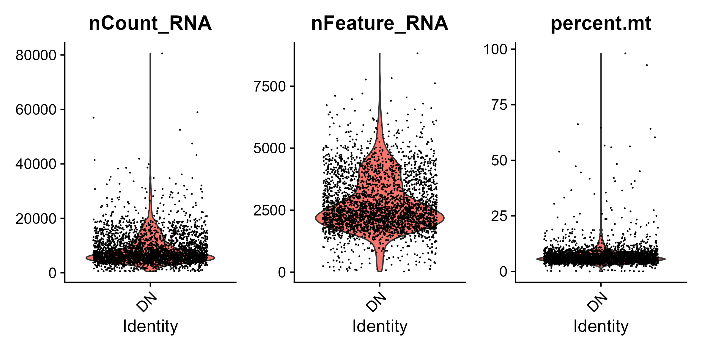

Özellikler arasındaki ilişkileri incelemek için `FeatureScatter` kullanılabilir.
```R
plot1 <- FeatureScatter(seurat_obj, feature1 = "nCount_RNA", feature2 = "percent.mt")
plot2 <- FeatureScatter(seurat_obj, feature1 = "nCount_RNA", feature2 = "nFeature_RNA")
plot1 + plot2
```
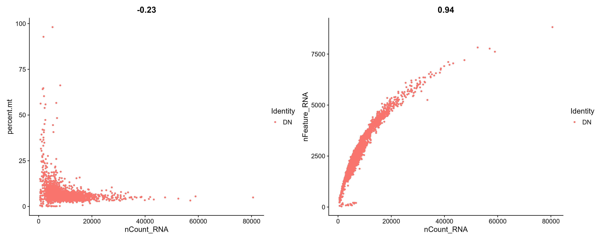

Gen sayısı ve transkript sayısı arasındaki korelasyona dayalı olarak iki metrikten birini ve mitokondriyal yüzdeleri filtreleme için kullanabiliriz. Bu veri seti için 400 ile 6000 arasında tespit edilen gen sayısı ve %10'dan düşük bir mitokondriyal ekspresyon yüzdesi kullanılmıştır. Ancak, farklı filtreleme eşikleri de değerlendirilebilir.

```R
seurat_obj <- subset(seurat_obj, subset = nFeature_RNA > 400 & nFeature_RNA < 6000 & percent.mt < 10)
```
Filtreleme adımından sonra violin grafiği ile görselleştirme yapılabilir.

```R
VlnPlot(seurat_obj, features = c("nCount_RNA", "nFeature_RNA", "percent.mt"))
```
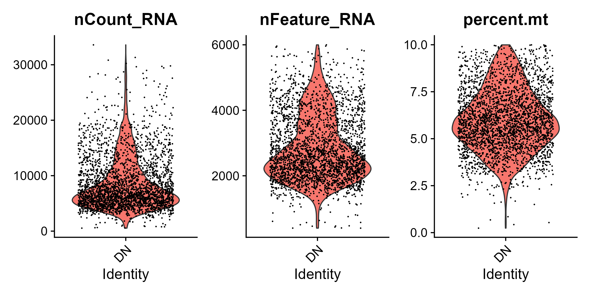

Bazı durumlarda, temel filtreleme metriklerinin yanı sıra ek filtreleme adımlarına ihtiyaç duyulabilir. Özellikle en büyük zorluklardan biri, doublet ve multiplet hücrelerin varlığıdır. Standart filtreleme işlemleri sonucunda bazı doubletler veya multipletler fark edilmeyebilir. Bu tür hücreler veri setinde kaldığında analiz sonuçlarını yanıltabilir. Bu nedenle, doublet tespitine yönelik özel araçlar kullanmak önemlidir. 

[DoubletFinder](https://www.sciencedirect.com/science/article/pii/S2405471219300730), scRNA-seq veri setlerinde doublet hücreleri tespit etmek için tasarlanmış etkili bir araçtır. Bu yazılım, standart filtreleme işlemlerinden sonra bile fark edilmeyen problemli hücreleri belirleyerek veri setinin kalitesini artırır. DoubletFinder, yapay doubletler oluşturma ve karşılaştırma yöntemini kullanarak yüksek hassasiyetle çalışır. Bu sayede, analizlerde yanlış sonuçlara yol açabilecek doublet ve multipletlerin tespit edilmesine ve çıkarılmasına yardımcı olur.

## 1.4. Normalizasyon 

scRNA-seq (tek hücreli RNA dizileme) normalizasyonu, her hücredeki gen ekspresyon seviyelerinin karşılaştırılabilirliğini sağlamak için kritik bir adımdır. Bu aşama, farklı hücreler ve deneyler arasındaki teknik varyasyonları düzeltmek amacıyla yapılır, aynı zamanda biyolojik farklılıkları korumayı hedefler.

Normalizasyon sürecinde, her hücredeki toplam gen ekspresyonu, belirli bir referans değere (örneğin, toplam RNA miktarına) oranlanır. Yaygın bir yöntem olan CPM (Counts Per Million), her hücrenin gen ekspresyon seviyelerini, o hücredeki toplam gen ekspresyonuna böler ve bu oranları belirli bir çarpanla (genellikle 10,000 veya 1,000,000) çarpar. Bu yaklaşım, gen ekspresyon seviyelerini standart hale getirerek, farklı hücreler arasında biyolojik farklılıkların daha iyi değerlendirilmesini sağlar.

Normalizasyon işlemi, hücre boyutu ve RNA içeriği gibi faktörleri de dikkate alır. Ayrıca, genellikle normalizasyondan sonra logaritmik dönüşüm uygulanır (log-normalizasyon), bu da verilerin dağılımını iyileştirir ve downstream analizler için daha uygun hale getirir. Sonuç olarak, normalizasyon teknik varyasyonları azaltırken biyolojik farklılıkları koruyarak, scRNA-seq verilerinin doğru yorumlanmasını sağlar.

Normalizasyon için kullanılan `NormalizeData` fonksiyonunun çeşitli parametreleri bulunmakla birlikte, varsayılan ayarları çoğu durumda yeterli ve tercih edilir.

```R
seurat_obj <- NormalizeData(seurat_obj)
```


## 1.5 Değişken Özelliklerin Belirlenmesi (özellik seçimi)

Çok değişken özelliklerin belirlenmesi, scRNA-seq analizinde önemli bir adımdır ve genellikle özellik seçimi olarak adlandırılır. Bu süreç, veri setindeki genler arasındaki varyasyonu değerlendirmeye odaklanır ve en yüksek varyansa sahip genlerin belirlenmesini sağlar. Bu genler, biyolojik olarak anlamlı değişimleri yansıtma potansiyeline sahiptir ve analizde dikkate alınması gereken önemli özelliklerdir.

`FindVariableFeatures` fonksiyonu, scRNA-seq verilerinde en yüksek varyansa sahip genleri belirlemek için kullanılır. `selection.method` parametresi, en yüksek varyansa sahip genleri belirlemek için kullanılan yöntemi tanımlar ve varsayılan olarak "vst" (variance stabilizing transformation) olarak ayarlanmıştır; `nfeatures` parametresi ise seçilecek değişken özellik sayısını belirler ve varsayılan değeri 2000'dir. Genel olarak, 2000 gibi bir başlangıç değeri yaygın olarak kullanılır, ancak bu değeri veri setinin büyüklüğü, analiz hedefleri, genlerin varyans dağılımı ve hesaplama gücü gibi faktörlere göre özelleştirmek mümkündür.

```R
seurat_obj <- FindVariableFeatures(seurat_obj)
```

Sonuçlar, `VariableFeaturePlot` fonksiyonu ile görselleştirilebilir.

```R
top10 <- head(VariableFeatures(seurat_obj), 10)

# plot variable features with and without labels
plot1 <- VariableFeaturePlot(seurat_obj)
plot2 <- LabelPoints(plot = plot1, points = top10, repel = TRUE)
plot1 + plot2

```
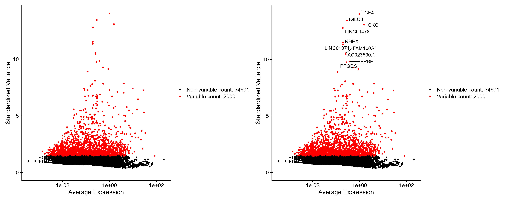

## 1.6. Veri Ölçeklendirme 

scRNA-seq analizinde scale data (veri ölçeklendirme) aşaması, normalizasyondan sonra gelen bir adımdır. Bu süreç, seçilen özelliklerin veya genlerin ekspresyon değerlerini karşılaştırılabilir hale getirmeyi ve aşırı değişken genlerin etkisini dengelemeyi amaçlar. Böylece, yüksek ifade edilen genlerin baskınlığı önlenir. Ölçeklendirme işlemi, tipik olarak her genin ortalama ekspresyonunu 0'a, varyansını ise 1'e ayarlayarak gerçekleştirilir. Bu, genellikle z-skor dönüşümü kullanılarak yapılır.

```R
seurat_obj <- ScaleData(seurat_obj)
```
`ScaleData` fonksiyonu, verileri ölçeklendirirken aynı zamanda istenmeyen varyasyon kaynaklarını regrese etme (yani etkisini azaltma) imkanı sunar. Buradaki `vars.to.regress = "percent.mt"` parametresi, mitokondriyal gen yüzdesi ("percent.mt") ile ilişkili varyasyonun regrese edilmesini sağlar. Regresyon işlemi, teknik varyasyonu azaltmak için etkili olsa da, verilerin doğal biyolojik sinyallerini incelemek için analiz sürecinin başında yapılmaması daha uygundur, veriyi anladıktan sonra ihtiyaç duyulursa uygulanmalıdır.

```R
seurat_obj <- ScaleData(seurat_obj, vars.to.regress = "percent.mt")
```

Bu analizde geleneksel normalizasyon, değişken genlerin belirlenmesi ve veri ölçekleme yöntemleri kullanılmıştır. Bu işlemler sırasıyla `NormalizeData`, `FindVariableFeatures` ve `ScaleData` fonksiyonları ile gerçekleştirilmiştir. Alternatif olarak, [SCTransform](https://genomebiology.biomedcentral.com/articles/10.1186/s13059-019-1874-1) yöntemi kullanılabilir; bu yöntem, normalizasyon, değişken genlerin belirlenmesi ve veri ölçekleme işlemlerini tek bir adımda gerçekleştiren daha gelişmiş bir yaklaşımdır. SCTransform, büyük ve heterojen veri setlerinde etkili sonuçlar verir; ancak bu yöntem, daha fazla hesaplama gücü ve zaman gerektirmesiyle birlikte karmaşıklığı nedeniyle zorlayıcı olabilir.

## 1.7. Temel Bileşen Analizi ile Boyut Azaltma

Boyut indirgeme, scRNA-seq verilerinde çok sayıda genin ölçüldüğü yüksek boyutlu veri setlerinin daha basit bir yapıya indirgenmesini sağlar. Yüksek boyutlu veriler, analiz edilmesi zor ve gürültüye duyarlı olabilir; bu nedenle boyut indirgeme ile verinin en önemli varyasyonlarını koruyarak daha az bileşenle temsil edilmesi gereklidir. Bu sayede analiz süreçleri hızlanır, görselleştirme kolaylaşır ve daha net biyolojik anlamlar çıkarılabilir.

Bu amaçla scRNA-seq analizinde en sık kullanılan yöntem Temel Bileşen Analizidir (PCA). PCA, verideki gen ekspresyonu varyasyonunu en iyi şekilde açıklayan "temel bileşenler" (principal components) adı verilen yeni eksenler oluşturur. Bu bileşenler, verideki en büyük varyansı açıklayan yönleri belirler ve veri, bu bileşenler üzerinden yeniden düzenlenir. `RunPCA` fonksiyonunda varsayılan olarak 50 temel bileşen (PCs) hesaplanır, ancak `npcs` parametresi ile bu sayı değiştirilebilir.

```R
seurat_obj <- RunPCA(seurat_obj)
```
PCA sonucunda, ilk birkaç temel bileşen verideki en fazla varyasyonu içerir. Genellikle, ilk bileşenler hücre tipleri arasındaki farklılıkları açıkça gösterirken, sonraki bileşenler daha küçük veya teknik varyasyonları yakalayabilir. Bu adım sayesinde, verideki biyolojik anlam taşıyan varyasyonlar ön plana çıkarılarak hücre kümeleri arasında ayrışma sağlanır.

PCA'dan sonra, kaç temel bileşenin (principal component) analiz için kullanılacağına karar vermek amacıyla `ElbowPlot` fonksiyonu kullanılır. Elbow plot, her bir bileşenin verideki toplam varyansı ne kadar açıkladığını görselleştirir. Grafik, bileşen sayısına karşı açıklanan varyansı gösterir ve genellikle bir "dirsek" (elbow) noktası fark edilir. Bu nokta, eklenen her yeni bileşenin varyansa katkısının azalmaya başladığı yerdir. Genellikle bu dirsek noktasında durmak, analiz için yeterli biyolojik bilgiyi içerir, ancak gereksiz bileşenleri eklemeden veri boyutunu da azaltır. Bu sayede, analizde en anlamlı ve varyansı yüksek bileşenler kullanılır.

```R
ElbowPlot(seurat_obj, ndims = 50)
```


Ayrıca, `DimHeatmap`, farklı temel bileşenlerin verideki hangi genetik varyasyonları temsil ettiğini ve varyasyonun bileşenler arasında nasıl dağıldığını incelemek için kullanılır. Bu analiz, kaç temel bileşenin seçileceğine karar verme sürecinde faydalı olabilir.

```R
DimHeatmap(seurat_obj, dims = 1:20, cells = 500, balanced = TRUE)
```

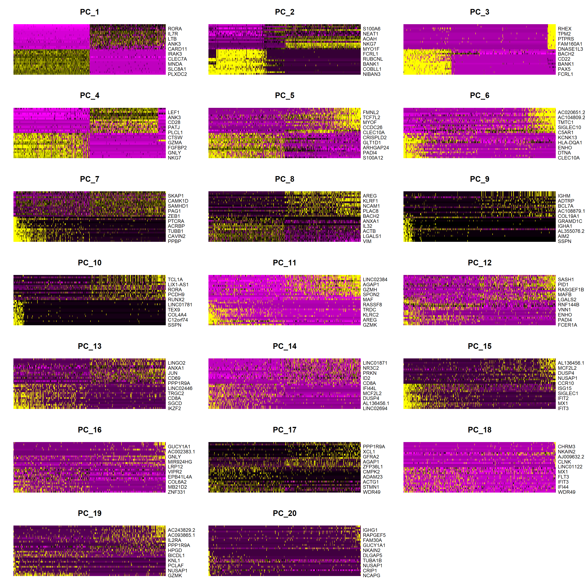

Elbow plot ve DimHeatmap sonuçlarına dayanarak analizde ilk 20 temel bileşen (PCs) seçildi. Kaç PCs seçileceğine karar vermek için kesin bir kural olmamakla birlikte, farklı sayıda PCs ile denemeler yapılarak en uygun sonuçlar belirlenebilir.

## 1.8. Hücreleri Kümeleme 
Hücreleri kümeleme adımı, scRNA-seq analizinde hücrelerin gen ekspresyon profillerine göre benzer gruplar halinde sınıflandırılmasını sağlar. Bu süreç, farklı hücre tiplerini, hücresel durumları veya biyolojik işlevleri ortaya çıkarmak için kullanılır. Genellikle, PCA gibi boyut indirgeme yöntemleri ile hücreler arasındaki temel farklılıklar belirlenir ve daha sonra bu farklılıklar baz alınarak hücreler kümelere ayrılır. Kümelenen hücreler, daha sonra biyolojik anlam taşıyan gruplara atanarak hücre tiplerinin tanımlanması ve yeni hücre popülasyonlarının keşfi sağlanır.

Kümeleme sürecinde ilk adım, hücreler arasındaki benzerliklerin belirlenmesi için `FindNeighbors` fonksiyonunun kullanılmasıdır. Bu fonksiyon, PCA ile elde edilen temel bileşenleri kullanarak her hücre arasındaki mesafeyi hesaplar ve hücreler arası ilişkiler üzerinden bir komşuluk grafiği oluşturur. Bu adım, hücrelerin birbirlerine ne kadar benzediğini belirlemek ve kümeleme için bir temel oluşturmak açısından kritiktir.

```R
seurat_obj <- FindNeighbors(seurat_obj, dims = 1:20)
```
Ardından, hücrelerin kümelere ayrılması için `FindClusters` fonksiyonu kullanılır. Bu fonksiyon, hücreler arası mesafelere dayalı olarak Louvain veya Leiden algoritmaları gibi kümeleme algoritmalarıyla hücreleri gruplar. Küme sayısı, `resolution` parametresi ile ayarlanabilir ve 0.1 ile 2.0 arasında değerler alabilir. Daha yüksek değerler daha fazla sayıda küçük kümeler oluştururken, daha düşük değerler daha az sayıda, daha büyük kümeler oluşturur.

```R
seurat_obj <- FindClusters(seurat_obj)
```

## 1.9. Non-linear Dimensional Reduction (UMAP/tSNE)

Non-linear boyut azaltma yöntemleri, özellikle karmaşık ve yüksek boyutlu verileri daha anlaşılır hale getirmek için kullanılır. scRNA-seq analizinde, UMAP (Uniform Manifold Approximation and Projection) ve t-SNE (t-distributed Stochastic Neighbor Embedding) gibi yöntemler, hücreler arasındaki benzerlikleri ve farklılıkları görselleştirmeye yardımcı olur.

```R
seurat_obj <- RunUMAP(seurat_obj, dims = 1:20)
seurat_obj <- RunTSNE(seurat_obj, dims = 1:20)
```

Sonuçları görselleştirmek ve hücre kümelerini incelemek için `DimPlot` kullanılabilir. Bu fonksiyon, UMAP ve TSNE ile elde edilen düşük boyutlu temsilde hücrelerin dağılımını gösterir, böylece hücre kümeleri arasındaki ilişkileri ve farklılıkları daha iyi anlamak mümkün olur.

```R
dimplot1 <- DimPlot(seurat_obj, reduction = "umap")
dimplot1 <- DimPlot(seurat_obj, reduction = "tsne")

dimplot1 + dimplot2
```
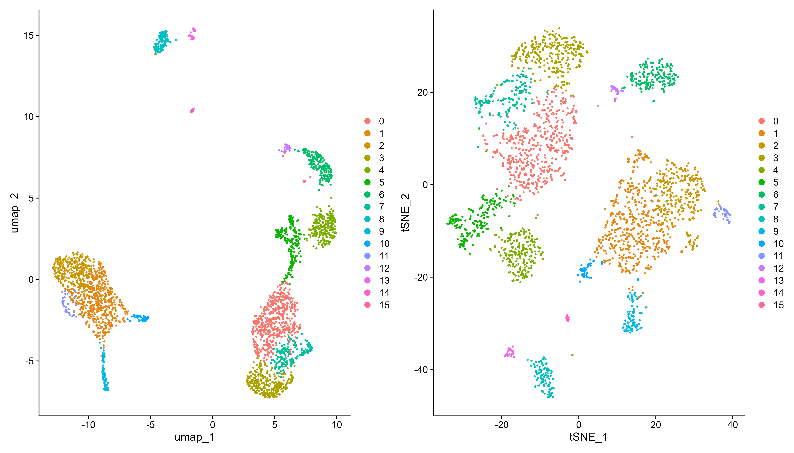

## 1.10. Diferansiyel Olarak İfade Edilen Belirteçlerin Belirlenmesi ve Hücre Tiplerini Atama

Hücreleri kümelemek, scRNA-seq analizi sürecinin önemli bir aşamasıdır. Bu adım, benzer gen ekspresyon profillerine sahip hücrelerin gruplandırılmasını sağlar ve hücresel heterojenitenin anlaşılmasına katkıda bulunur. Kümeleme, hücrelerin biyolojik özelliklerine göre organize edilmesine olanak tanır ve genellikle belirteçler, literatür verileri veya otomatik yaklaşımlar kullanılarak gerçekleştirilir. Belirteçlere dayalı yöntemler, daha önce tanımlanmış gen setleri üzerinden hücre tiplerini belirlemeye yönelik olarak kullanılabilirken; otomatik yöntemler, makine öğrenimi algoritmaları ile hücreleri daha objektif bir şekilde sınıflandırma imkanı sunar.

Kümeleme adımının ardından, her bir küme için belirteçler atanarak bu hücre gruplarının tanımlanması sağlanır. Belirteçler, belirli hücre tiplerine özgü genlerin ekspresyon seviyeleri üzerinden belirlenir ve genellikle literatürdeki referanslar doğrultusunda seçilir. Belirteçlerden bazıları şunları içerir:

- CD4+ T cells: IL7R, CCR7
- CD8+ T cells: CD8A, CD8B
- CD14+ Monocytes: CD14, LYZ
- B cells: MS4A1, CD79A
- Natural killer (NK) cells: GNLY, NKG7, KLRB1
- Dendritic Cells: FCER1A, CST3
- FCGR3A+ Monocytes: FCGR3A, MS4A7
- Platelets: PPBP, PF4

Bu aşamada `FeaturePlot`, `DimPlot` ve `DoHeatmap` gibi görselleştirme araçları kullanılarak, belirteçlerin hücre grupları içindeki dağılımı ve yoğunluğu incelenir.

```R
FeaturePlot(seurat_obj, features = c("IL7R", "CCR7","CD8A", "CD8B", "CD14", "LYZ", "MS4A1", "CD79A", "GNLY",
                                     "NKG7", "FCER1A", "CST3", "PPBP", "PF4", "FCGR3A", "MS4A7"))

```
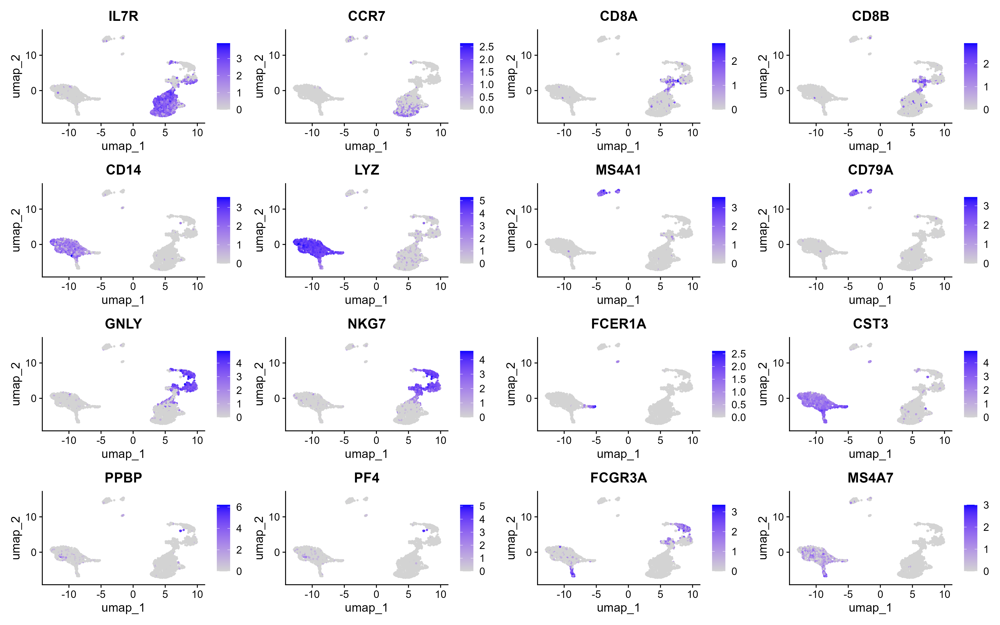

```R
DoHeatmap(seurat_obj, features = c("IL7R", "CCR7","CD8A", "CD8B", "CD14", "LYZ", "MS4A1", "CD79A", "GNLY",
                                   "NKG7", "FCER1A", "CST3", "PPBP", "PF4", "FCGR3A", "MS4A7")) + NoLegend()

```
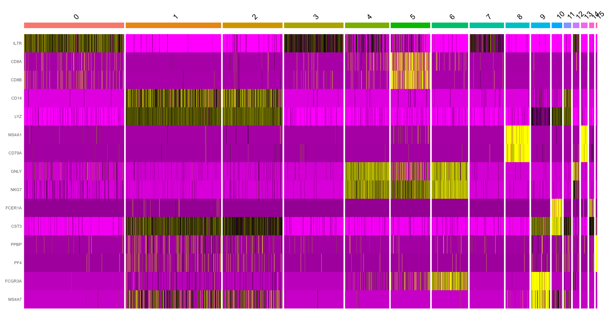

Aynı zamanda, belirteçleri violin ve feature plot ile kombinleyerek ayrıntılı bir bakış sağlanabilir. Örneğin, CD8A ve CD8B belirteçleri küme 5'in güçlü belirteçleri olarak karşımıza çıkıyor.

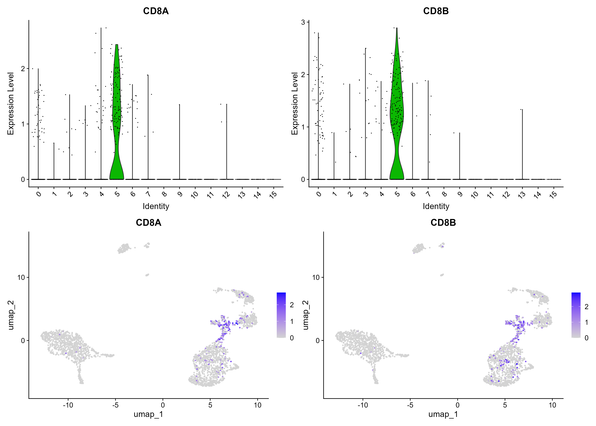

Son olarak, diferansiyel olarak ifade edilen genlerin belirlenmesi için `FindAllMarkers` fonksiyonu kullanılır. Bu fonksiyon, her bir hücre kümesi için belirgin şekilde ifade edilen genleri tespit eder ve farklı hücre tipleri arasındaki gen ekspresyon farklılıklarını ortaya koyar. scRNA-seq verilerinin boyutunu göz önünde bulundurarak, kümelerdeki genlerin tespit oranını belirlemek için `min.pct` ve kat değişimini `logfc.threshold` yansıtmak için çeşitli parametreler girilebilir. Burada, her genin en az %25'inin hücrelerde ifade edilmesini sağlamak amacıyla `min.pct = 0.25` eşiğini belirler; ayrıca, genlerin en az %20'lik bir artış göstermesi gerektiğini belirtmek için `logfc.threshold = log(1.2)` parametresini kullanır.

```R
markers <- FindAllMarkers(seurat_obj, only.pos = TRUE, min.pct = 0.25, logfc.threshold = log(1.2))
```

Her küme için ifade edilen en yüksek on belirteç belirlenip, `DoHeatmap` fonksiyonu kullanılarak ısı haritaları oluşturulur. Bu görselleştirme, gen ekspresyonundaki farklılıkları ve kümeler arasındaki ilişkileri açık bir şekilde sunarak sonuçların yorumlanmasına yardımcı olur. Böylece, hücre tipleri ve bu tiplerin belirteçleri hakkında derinlemesine bir anlayış sağlanmış olur.

```R
top10_markers <- markers %>% 
  group_by(cluster) %>% 
  top_n(n = 10, wt = avg_log2FC)

DoHeatmap(seurat_obj, features = top10_markers$gene) + NoLegend() + theme(axis.text.y = element_text(angle = 0, hjust = 1, size = 6))

```

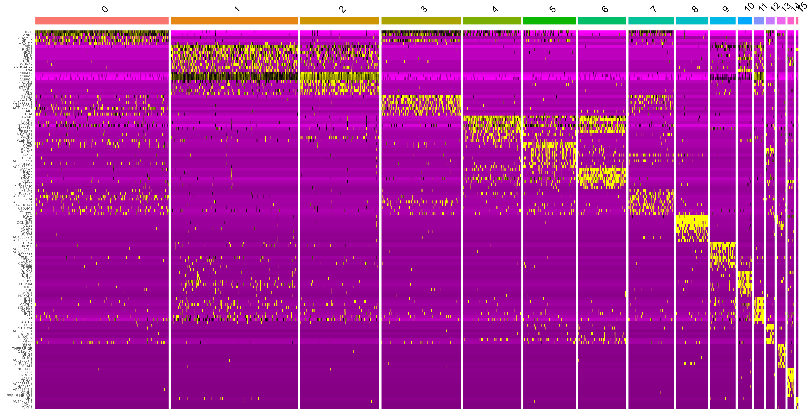

CD4+ T hücrelerini temsil eden kümeler, belirteçler ve gen ekspresyon profillerine dayanarak küme 0, 3 ve 7 olarak belirlenmiştir. CD8A ve CD8B genlerinin güçlü ekspresyon gösterdiği küme 5 ise CD8+ T hücrelerine aittir. Küme 1, 2 ve 11 CD14+ monositlere, küme 9 ise FCGR3A+ monositlere atanmaktadır. MS4A1 ve CD79A genlerinin yüksek seviyede ifade edildiği küme 8 ve 13, B hücreleri olarak sınıflandırılmıştır. Küme 4 ve 6 NK hücrelerine, küme 10 ve 14 ise dendritik hücrelere karşılık gelmektedir. Son olarak, küme 15, plateletler olarak tespit edilmiştir.
 
Hücre kümelerinin bu şekilde atamaları yapılabilir; ancak bunun öznel olduğunu düşünebilirsiniz. Bu atamaları daha nesnel hale getirmek için SingleR gibi araçlar kullanılabilir. SingleR, referans veri setleri ile karşılaştırma yaparak hücre tiplerini otomatik olarak atamaya olanak tanır. Örneğin, referans olarak immün hücre veri tabanları kullanılarak, her bir hücrenin en yakın referans hücresi belirlenebilir ve bu sayede hücre tipi atamaları daha sistematik ve objektif bir şekilde gerçekleştirilebilir. SingleR çıktıları, manuel analizlerle karşılaştırıldığında tutarlılık sağlanması da analiz doğruluğunu artırır.

Hücre tipleri, hücre kümelerine atanabilir. Her küme için belirlenen hücre tipleri bir vektöre aktarılır ve names fonksiyonu ile bu hücre tipleri, Seurat objesindeki mevcut kümelerle eşleştirilir. `RenameIdents` fonksiyonu kullanılarak, Seurat objesindeki hücre kümeleri bu yeni hücre tiplerine göre yeniden adlandırılır. Bu sayede, her hücre kümesi biyolojik olarak anlamlı hücre tipleriyle eşleştirilmiş olur.

```R
new.ids <- c("CD4+ T", "CD14+ Mono", "CD14+ Mono", "CD4+ T", "NK", "CD8+ T", "NK", "CD4+ T", "B cell",
             "FCGR3A+ Mono", "DC", "CD14+ Mono", "NK", "B cell", "DC", "Platelets" )
names(new.ids) <- levels(seurat_obj)
seurat_obj <- RenameIdents(seurat_obj, new.ids)
```

`DimPlot` fonksiyonu kullanılarak atanan hücre tipleriyle bir görselleştirme yapılabilir.

```R
DimPlot(seurat_obj, reduction = "umap", label = TRUE, pt.size = 1) + NoLegend()
```
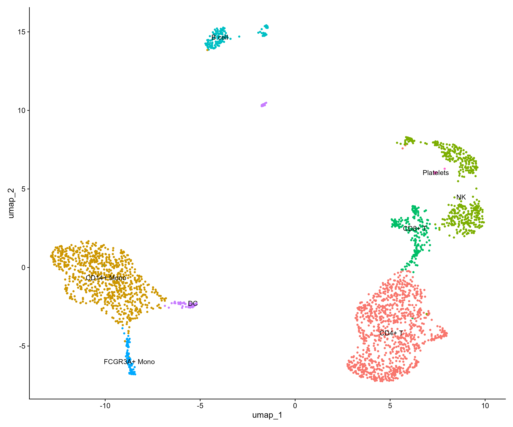

## 1.11. Sonuçları Kaydetme

Buraya kadar yapılan analizler, tek bir scRNA-seq verisi ile gerçekleştirilen analizleri kapsar. Bu işlemin sonunda, Seurat objesini kaydederek yeniden analiz yapmaya gerek kalmaz. Seurat objesi, `saveRDS` fonksiyonu kullanılarak kaydedilebilir ve daha sonra `readRDS` fonksiyonu ile tekrar yüklenebilir. Bu sayede, analizin ilerleyen aşamalarında aynı obje üzerinde çalışmaya devam edilebilir.

```R
saveRDS(seurat, file="DN1/seurat_obj_final.rds")
seurat <- readRDS("DN1/seurat_obj_final.rds")
```
## Bölüm 2: Birden Fazla scRNA-seq Verisini Entegre Etme

Tek bir scRNA-seq verisiyle analiz yapmak az rastlanan bir durumdur ve biyolojik çeşitliliği ile koşulları yansıtmakta sınırlı kalabilir. Bu nedenle, farklı koşullardan ve örneklerden gelen scRNA-seq verilerinin entegre edilmesi, hücresel çeşitliliği ve biyolojik varyasyonları daha geniş bir perspektifte inceleme olanağı sağlar. Çoklu scRNA-seq verilerini birleştirmek, biyolojik sistemlerdeki ortak ve benzersiz hücresel durumları anlamamıza olanak tanır. Bununla birlikte, veri entegrasyonu süreci teknik zorluklar barındırır. Her örneğin kendine has batch etkileri, biyolojik ve teknik varyasyonları dikkate alınarak birleştirilmesi gerekir. İyi bir entegrasyon stratejisi, hücresel farklılıkları korurken teknik etkileri minimize etmeyi hedefler. Bu yaklaşım, araştırmacılara daha kapsamlı analizler yapma ve biyolojik sistemlerin daha derinlemesine anlaşılmasını sağlar.

Bu bölümde, birden fazla scRNA-seq verisinin nasıl entegre edildiği ve entegrasyon sürecinde kullanılan yöntemler incelenecektir.


## 2.1. Kütüphaneleri Ortama Entegre Etme

Birincil adımda çalışmada kullanıcak paketler ortama entegre edilir.

```R
library(Seurat)
library(tidyverse)
````

## 2.2. Verileri Yükleme ve Seurat Nesnesi Oluşturma

Bölüm 1'de yalnızca DN1 verisi ile çalışılırken, bu aşamada OV1 ve DN1 verileri birleştirilerek iki veri seti üzerinde çalışma gerçekleştirilecektir. Bölüm 1'de olduğu gibi, OV1 ve DN1 verileri `ReadMtx` fonksiyonu ile okunduktan sonra, `CreateSeuratObject` fonksiyonu kullanılarak her bir veri seti için Seurat nesneleri oluşturulur.

```R
OV1_counts <- ReadMtx(mtx = "GSE264489_RAW/GSM8218878_Ov1_matrix.mtx.gz",
                      features = "GSE264489_RAW/GSM8218878_Ov1_features.tsv.gz",
                      cells = "GSE264489_RAW/GSM8218878_Ov1_barcodes.tsv.gz")

OV1_seurat <- CreateSeuratObject(counts = OV1_counts, min.cells = 3, min.features = 200, project = "OV1")

DN1_counts <- ReadMtx(mtx = "GSE264489_RAW/GSM8218884_Dn1_matrix.mtx.gz",
                  features = "GSE264489_RAW/GSM8218884_Dn1_features.tsv.gz",
                  cells = "GSE264489_RAW/GSM8218884_Dn1_barcodes.tsv.gz")

DN1_seurat <- CreateSeuratObject(counts = DN1_counts, min.cells = 3, min.features = 200, project = "DN1")

```

## 2.3. Seurat Nesnelerini Birleştirmek

Bu aşamada, iki farklı Seurat nesnesi (OV1_seurat ve DN1_seurat) `merge` fonksiyonu kullanılarak birleştirilir. Bu işlem, iki farklı örnekten gelen hücrelerin aynı analiz ortamında değerlendirilmesini sağlar.

```R
seurat_merged <- merge(x=OV1_seurat, y=DN1_seurat, add.cell.ids = c("OV1", "DN1"), project="HGSOC")
```

## 3.4. Kalite Kontrol

Seurat nesnelerini birleştirdikten sonra, temel veri işleme adımları izlenir. İlk olarak, kalite kontrol aşamasında hücrelerin mitokondriyal gen ekspresyon oranı hesaplanır. Bu oran, hücrelerin sağlığını ve kalitesini değerlendirmek için önemli bir metrik olarak kullanılır. Ardından, violin grafikleri kullanılarak kalite kontrol metriklerinin dağılımı görsel olarak incelenir.

```R
seurat_merged$percent.mt <- PercentageFeatureSet(seurat_merged, pattern = "^MT")          
VlnPlot(seurat_merged, features = c("nCount_RNA", "nFeature_RNA", "percent.mt"))   

```
Grafik incelenerek, bu veri seti için hücre başına tespit edilen gen sayısının 400 ile 6000 arasında olması ve mitokondriyal ekspresyon yüzdesinin %10'dan düşük olmasının uygun olduğu görülebilir. Bu sınırlar, kalite kontrol aşamasında hücreleri filtrelemeye yardımcı olur ve analizde sadece biyolojik olarak anlamlı ve sağlıklı hücreler tutulur. 

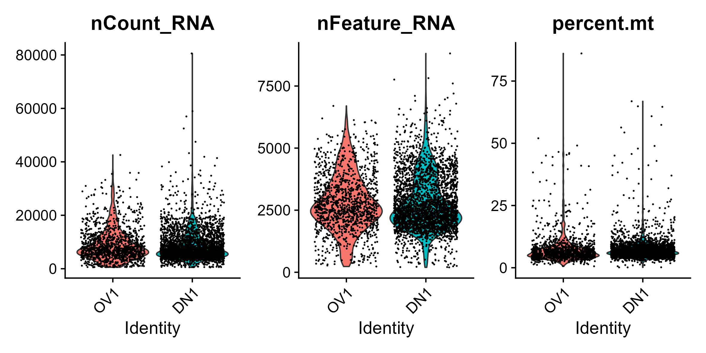

```R
seurat_merged <- subset(seurat_merged, subset = nFeature_RNA > 400 & nFeature_RNA < 6000 & percent.mt < 10)
```

Violin grafiği kullanılarak, filtreleme öncesi ve sonrası kalite metriklerindeki değişiklikler görsel olarak incelenebilir.

```R
VlnPlot(seurat_merged, features = c("nCount_RNA", "nFeature_RNA", "percent.mt"))
```
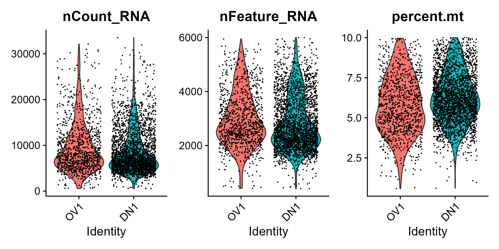

## 3.5. Temel Veri İşleme Adımları

Bu adım, Bölüm 1'den aşina olduğumuz Seurat nesnesi üzerinde temel veri işleme ve hücre kümeleme adımlarını gerçekleştirir. İlk olarak, hücreler arası teknik farklılıkları gidermek için veri normalizasyonu yapılır. Ardından, en değişken genler belirlenir ve bu genler kullanılarak veriler ölçeklendirilir. PCA (Principal Component Analysis) ile boyut indirgeme gerçekleştirilir ve hücreler arasındaki ilişkiler belirlenir. Bu ilişkiler kullanılarak hücreler kümelere ayrılır (clustering), ve son olarak UMAP ile hücreler 2 veya 3 boyutlu bir alanda görselleştirilir. Bu işlemler, hücre popülasyonları arasındaki farklılıkları keşfetmek ve görselleştirmek için temel adımlardır.

```R
seurat_merged <- seurat_merged %>% 
  NormalizeData() %>% 
  FindVariableFeatures() %>% 
  ScaleData() %>% 
  RunPCA() %>% 
  FindNeighbors(dims = 1:30, reduction = "pca") %>% 
  FindClusters(cluster.name = "unintegratedcluster") %>% 
  RunUMAP(dims = 1:30, reduction = "pca", reduction.name = "unintegratedUMAP")

```

Standart veri işleme adımlarından sonra, `DimPlot` fonksiyonu kullanılarak entegre edilmemiş veri setinin durumu incelenebilir. 

```R
unintegratedUMAP <- DimPlot(seurat_merged, reduction = "unintegratedUMAP", group.by = "orig.ident")
unintegratedUMAP
```

## 3.6. Harmony ile Entegrasyon

[Harmony](https://www.nature.com/articles/s41592-019-0619-0), scRNAseq verileri arasındaki batch etkilerini düzeltmek için kullanılan bir yöntemdir. Bu yöntem, örnekler arasındaki sistematik farklılıkları ortadan kaldırarak entegre edilmiş verilerin biyolojik olarak anlamlı olmasını sağlar. Harmony, her bir hücrenin yüksek boyutlu ifadesini dikkate alarak hücreler arasındaki benzerlikleri belirler ve bu sayede farklı örneklerden gelen hücrelerin doğru bir şekilde karşılaştırılmasını sağlar. Entegrasyon sonrasında elde edilen veri seti, hücre popülasyonları arasındaki biyolojik ilişkileri ve yapıların daha iyi anlaşılmasına olanak tanır.

Verileri entegre etmek için Seurat paketinin sunduğu `IntegrateLayers` fonksiyonu kullanılabilir. Entegrasyon yöntemini belirlemek için `method` parametresi girilmelidir. Bu durumda Harmony ile entegrasyon yapılacağı için `HarmonyIntegration` ifadesi kullanılmıştır.
```R
seurat_integrated <- IntegrateLayers(seurat_merged,
                                     method = HarmonyIntegration,
                                     new.reduction ="harmony",
                                     verbose=T)

```

Entegre edilme adımından sonra, aşağıdaki işlemler yineleme yapılarak verinin daha iyi analiz edilmesine ve sonuçların daha iyi anlaşılmasına olanak tanır.

```R
seurat_integrated <- seurat_integrated %>% 
  FindNeighbors(dims = 1:30, reduction = "harmony") %>% 
  FindClusters(cluster.name = "harmonyCluster") %>% 
  RunUMAP(dims = 1:30, reduction = "harmony", reduction.name = "harmonyUMAP")
```

Entegre edilmiş verinin görselleştirilmesi, `DimPlot` fonksiyonu ile gerçekleştirilebilir. Bu fonksiyonda `reduction` parametresine `harmonyUMAP` belirtilmelidir. Hücrelerin hangi örnekten geldiğini belirlemek için ise `group.by` parametresi kullanılarak gruplama yapılır.

```R
harmonyUMAP <- DimPlot(seurat_integrated, reduction = "harmonyUMAP", group.by = "orig.ident" )
harmonyUMAP
```
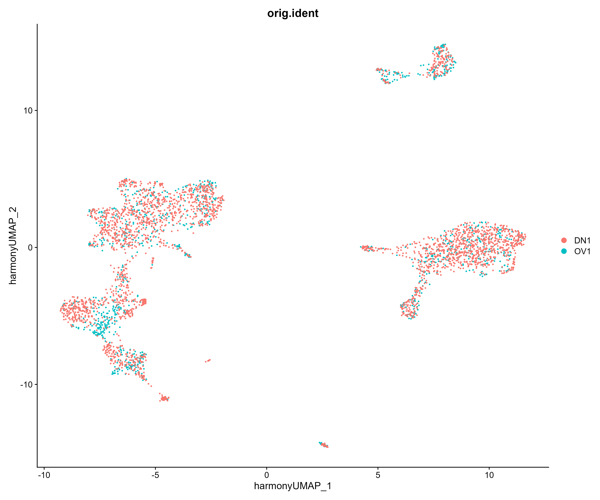

## 3.7. CCA (Canonical Correlation Analysis) ile Entegrasyon

Canonical Correlation Analysis (CCA), iki veya daha fazla veri seti arasındaki ilişkileri belirlemek için kullanılan güçlü bir istatistiksel yöntemdir. scRNA-seq verilerinin entegrasyonunda CCA, farklı hücre örnekleri veya deney grupları arasında ortak özellikleri ortaya çıkarmak amacıyla kullanılır. Bu yöntem, farklı veri setlerinde benzer hücresel popülasyonları veya biyolojik süreçleri tanımlamak için biyolojik olarak anlamlı ilişkileri açığa çıkarmak üzerine odaklanır.

CCA ile entegrasyon için `IntegrateLayers` fonksiyonunda yer alan method parametresine `CCAIntegration` belirtilmelidir.

```R
seurat_integrated <- IntegrateLayers(seurat_merged,
                                     method = CCAIntegration,
                                     new.reduction ="CCAIntegration",
                                     verbose=T)

```

Entegre edildikten sonra, aşağıdaki işlemler yineleme yapılarak verinin daha iyi analiz edilmesine ve sonuçların daha iyi anlaşılmasına olanak tanır.

```R
seurat_integrated <- seurat_integrated %>% 
  FindNeighbors(dims = 1:30, reduction = "CCAIntegration") %>% 
  FindClusters(cluster.name = "CCAcluster") %>% 
  RunUMAP(dims = 1:30, reduction = "CCAIntegration", reduction.name = "CCAUMAP")

```

CCA ile entegrasyon sonrası verilerin görselleştirilmesi, `DimPlot` fonksiyonu kullanılarak gerçekleştirilebilir. Bu fonksiyonda reduction parametresine `CCAUMAP` belirtilmeli ve hücrelerin hangi örnekten geldiğini belirlemek için `group.by` parametresi kullanılmalıdır.

```R
CCAumap <- DimPlot(seurat_integrated, reduction = "CCAUMAP", group.by = "orig.ident")
CCAumap
```
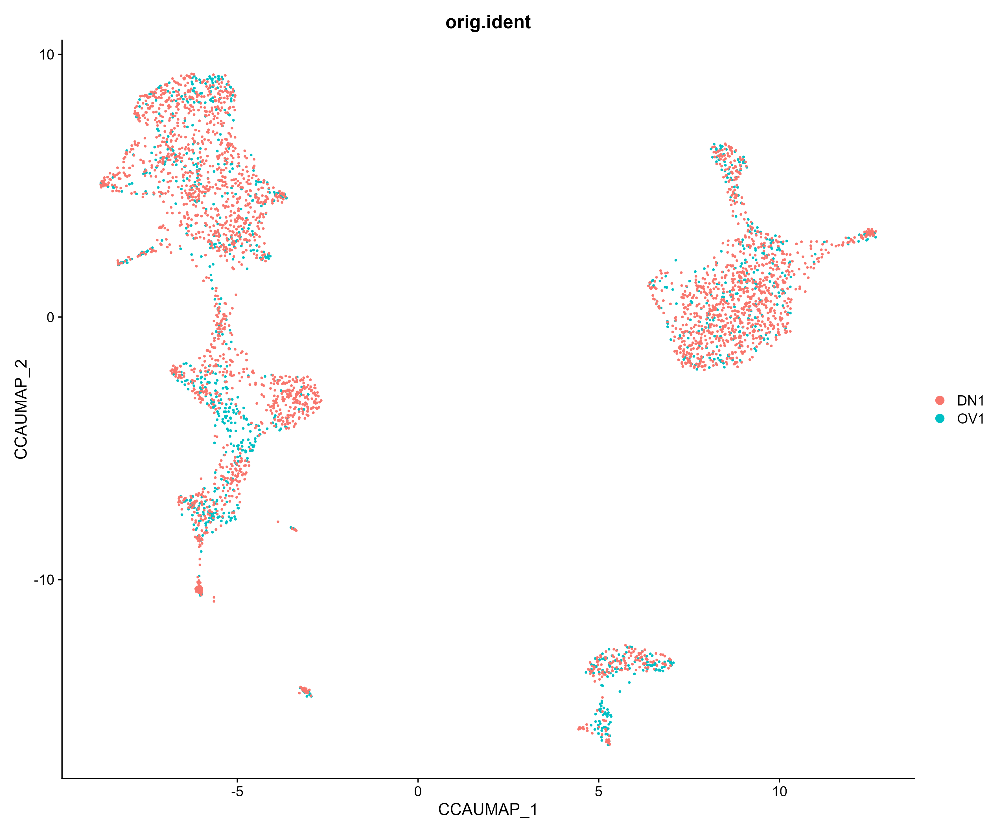

## 3.8. JointPCA ile Entegrasyon

Joint Principal Component Analysis (JointPCA), farklı veri setlerini bir araya getirerek bu veri setleri arasındaki ortak varyansı keşfetmek için kullanılan bir yöntemdir. Özellikle birden fazla tek hücreli RNA dizileme verilerinde, JointPCA, hücrelerin benzerliklerini ve farklılıklarını analiz ederek entegre edilmiş bir görünüm sunar.

Diğer analizlere benzer şekilde, JointPCA ile entegrasyon için `IntegrateLayers` fonksiyonunda yer alan method parametresine `JointPCAIntegration` belirtilmelidir.

```R
seurat_integrated <- IntegrateLayers(seurat_merged,
                                     method = JointPCAIntegration,
                                     new.reduction ="JPCAIntegration",
                                     verbose=T)
```

Aynı şekilde entegrasyon sonrası yinelemeli adımlar gerçekleştirilmelidir.

```R
seurat_integrated <- seurat_integrated %>% 
  FindNeighbors(dims = 1:30, reduction = "JPCAIntegration") %>% 
  FindClusters(cluster.name = "JPCAcluster") %>% 
  RunUMAP(dims = 1:30, reduction = "JPCAIntegration", reduction.name = "JPCAUMAP")
```

Görselleştirme için `DimPlot` kullanılabilir ve reduction parametresi `JPCAUMAP` olarak belirtilmelidir.

```R
JPCAUMAP <-DimPlot(seurat_integrated, reduction = "JPCAUMAP", group.by = "orig.ident")
JPCAUMAP
```

## 3.9. RPCA ile Entegrasyon

Robust Principal Component Analysis (RPCA), scRNA-seq verilerinin entegrasyonu için etkili bir yöntemdir. Farklı hücre dizilimi verilerini bir araya getirirken, RPCA, veri setleri arasındaki biyolojik benzerlikleri belirlemek ve teknik varyasyonu azaltmak için kullanılır. Bu yöntem, geleneksel PCA'nın sınırlamalarını aşarak, aykırı değerlerin etkisini en aza indirir ve verilerin gürültüden arındırılmasını sağlar.

Benzer şekilde, RPCA ile entegrasyon için `IntegrateLayers` fonksiyonunda yer alan method parametresine `RPCAIntegration` belirtilmelidir.

```R
seurat_integrated <- IntegrateLayers(seurat_merged,
                                     method = RPCAIntegration,
                                     new.reduction ="RPCAIntegration",
                                     verbose=T)
```

Yinelemeli adımlar çalıştırılmalıdır.

```R
seurat_integrated <- seurat_integrated %>% 
  FindNeighbors(dims = 1:30, reduction = "RPCAIntegration") %>% 
  FindClusters(cluster.name = "RPCAcluster") %>% 
  RunUMAP(dims = 1:30, reduction = "RPCAIntegration", reduction.name = "RPCAUMAP")
```

Görselleştirme için `DimPlot` fonksiyonu kullanılırken reduction parametresi `RPCAUMAP` olarak belirtilmelidir.

```R
RPCAUMAP <- DimPlot(seurat_integrated, reduction = "RPCAUMAP", group.by = "orig.ident")
RPCAUMAP
```
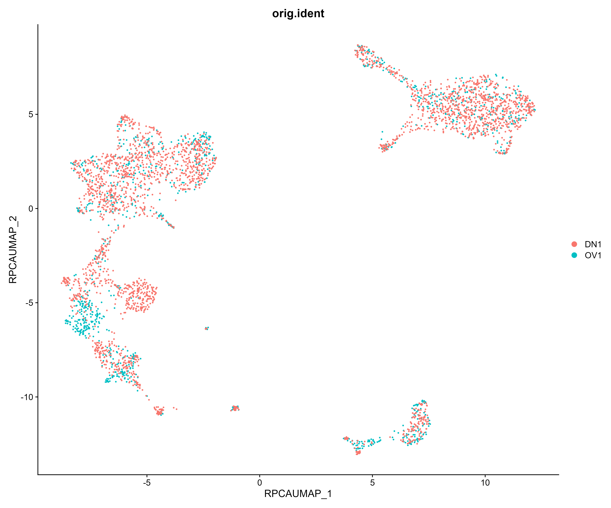

Entegrasyon yöntemlerini karşılaştırmak için görseller tek bir grafik üzerinde birleştirilebilir. Bu amaçla, `gridExtra` paketi, görsellerin düzenli bir şekilde yerleştirilmesine yardımcı olacaktır.

```R
library(gridExtra)

allUMAP <- grid.arrange(
  arrangeGrob(unintegratedUMAP, harmonyUMAP, CCAUMAP, ncol = 3),
  arrangeGrob(JPCAUMAP, RPCAUMAP, ncol = 2, widths = c(1, 1)), 
  nrow = 2)

allUMAP
```

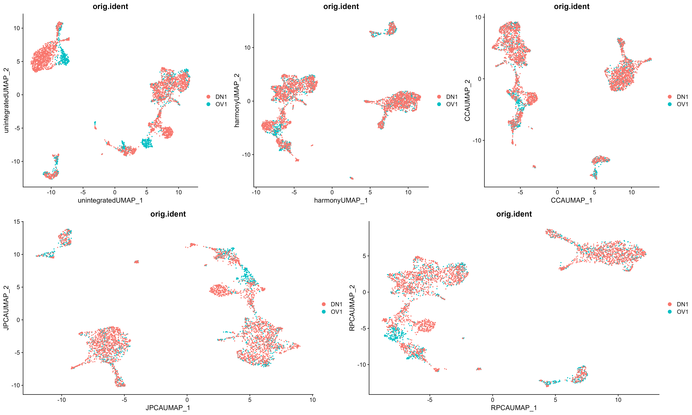

## 3.10. Peki, Hangi Entegrasyon Yöntemi Seçilmeli?

Veriler entegre edildikten sonra hücre kümeleme, belirteç tanımlama, hücre ataması, pseudotime  analizi ve diferansiyal ekspresyon analizi gibi çeşitli analizler yapılmaya devam edilebilir. Ancak, hangi entegrasyon yönteminin kullanılacağına karar verilmesi gerekir ki görüleceği üzere birden fazla seçenek bulunmaktadır. Tabi ki kesin bir kural olmamakla birlikte elinizde bulunan verilerin uygunluğu, analiz hedefleri ve spesifik araştırma sorularınız, hangi entegrasyon yönteminin seçileceği konusunda belirleyici unsurlar olacaktır. 

Seçtiğiniz yöntem, hücrelerin benzerliklerini ve farklılıklarını anlamak için kullanılan sonraki analizlerin kalitesini de etkileyebilir. Örneğin, entegre edilen veri setlerinde yapılan hücre kümeleme işlemleri, doğru entegrasyon yöntemi kullanıldığında daha anlamlı sonuçlar verecektir. Ayrıca, belirteç tanımlama ve hücre ataması gibi adımlar da entegre verilerin kalitesine bağlıdır.

Sonuç olarak, scRNA-seq verilerinin entegrasyonu, dikkatli bir değerlendirme ve yöntem seçimi gerektirir. Bu süreç, biyolojik yorumlamaların doğruluğunu ve analizin genel başarısını büyük ölçüde etkileyebilir. Verilerinizi en iyi şekilde anlamak ve analiz etmek için farklı entegrasyon yöntemlerini deneyerek en uygun olanı bulmanız önemlidir. Ayrıca, burada bahsedilen entegrasyon yöntemlerine ek olarak da farklı entegrasyon yöntemleri bulunmaktadır. Veri entegrasyonunda farklı yöntemlerin ölçeklenebilirlik, kullanılabilirlik, biyolojik çeşitlilik ve batch etkileri açısından karşılaştırılması için [makaleyi](https://www.nature.com/articles/s41592-021-01336-8) inceleyebilirsiniz.


## Bölüm 3: Daha Fazla Analiz?

scRNAseq analizinde temel adımlar ve veri entegrasyonu tamamlandıktan sonra aşağı akışta yapılabilecek çeşitli analizler vardır. Bu analizler, hücrelerin biyolojik işlevlerini, farklılıklarını ve özelliklerini derinlemesine anlamak için yapılır. Bu bölümde, scRNAseq analizinde daha detaylı bilgiler edinebileceğimiz ileri analizler ve bu analizlerde kullanılabilecek paketler hakkında konuşacağız.

## 3.1. Pseudotime Analizi (Trajectory Inference)

Pseudotime analizi, tek hücreli RNA dizileme (scRNAseq) verilerinde hücrelerin zaman içindeki gelişimsel veya farklılaşma süreçlerini anlamaya yardımcı olan önemli bir analiz yöntemidir. Hücrelerin biyolojik süreçlerdeki sıralı farklılaşmalarını tahmin eder. Özellikle embriyonik gelişim, hücre dönüşümü ve kanser hücrelerinin evrimi gibi senaryolarda yararlıdır.

Bu analiz, hücrelerin bir "zaman" ekseni boyunca nasıl hareket ettiğini görsel olarak göstermek için hücreler arasındaki benzerliklerden yararlanır. Gerçekte bir zaman serisi verisi olmadan, hücreler gelişim süreçlerinin hangi noktasında olduğunu tahmin edebiliriz. Bu tahmini zaman ölçüsü, pseudotime olarak adlandırılır.

Pseudotime analizi için kullanılabilecek bir çok yazılım bulunmaktadır. [Monocle](https://cole-trapnell-lab.github.io/monocle3/), pseudotime analizi için en popüler yazılımlardan biridir. Hücrelerin gelişimsel yollarını keşfetmek ve bu yolda gen ekspresyonunun nasıl değiştiğini analiz etmek için kullanılır. Bir diğer paket olan [Slingshot](https://github.com/kstreet13/slingshot), hücre trajektorisi bulmak için kümeleme ve bağlantı kurma yöntemlerini kullanır. Trajektori boyunca pseudotime hesaplaması yapar ve dallanma noktalarını belirler.

## 3.2. RNA Velocity Analizi

RNA velocity, hücrelerin mevcut mRNA transkript seviyelerine dayanarak gelecekteki gen ekspresyon durumlarını tahmin eden bir analiz yöntemidir. Bu analiz, tek hücreli RNA dizileme (scRNAseq) verilerinde hücrelerin zaman içindeki değişim hızını ve yönünü anlamak için kullanılır. RNA velocity, hücrelerin anlık transkripsiyonel durumunu analiz ederek gelişim süreçlerinin veya hücre farklılaşmasının gelecekte nasıl ilerleyeceğini tahmin eder.

RNA velocity, hücrelerdeki spliced ve unspliced mRNA'ların oranlarını hesaplar. Spliced mRNA, bir genin tam işlenmiş ve olgun hali olup, unspliced mRNA ise yeni sentezlenmiş, henüz işlemden geçmemiş formdur. Bu iki form arasındaki denge, hücrelerin hangi genlerin aktif olduğunu ve gelecekte bu genlerin ekspresyonunda nasıl bir değişiklik olacağını gösterir.

[scVelo](https://github.com/theislab/scvelo_notebooks?tab=readme-ov-file), RNA velocity analizinde kullanılan en popüler Python tabanlı yazılımlardan biridir. Spliced ve unspliced mRNA oranlarını analiz ederek hücrelerin gelecekteki gelişimsel yollarını tahmin eder. [Velocyto](https://github.com/velocyto-team/velocyto.R), RNA velocity'yi hesaplamak için ilk geliştirilmiş araçlardan biridir. Hem spliced hem de unspliced mRNA'ları kullanarak hücrelerin transkripsiyonel değişikliklerini ve gelişimsel süreçlerini tahmin eder.


## 3.3. Fonksiyonel Zenginleştirme Analizi (Gene Ontology / Pathway Enrichment)

Fonksiyonel zenginleştirme analizi, genlerin biyolojik işlevlerini ve hücredeki rollerini anlamak için yapılan önemli bir analizdir. Özellikle hücre kümeleri arasında farklılık gösteren genlerin biyolojik süreçlerle nasıl ilişkili olduğunu belirlemek için kullanılır. Bu sayede, genlerin hangi biyolojik süreçlerde, (biological process), hücresel bileşenlerde (cellular component) veya moleküler işlevlerde (molecular function) yer aldığını daha kapsamlı bir şekilde anlayabiliriz.

Fonksiyonel zenginleştirme analizi için çeşitli paketler bulunmaktadır. [clusterProfiler](https://github.com/YuLab-SMU/clusterProfiler?tab=readme-ov-file), fonksiyonel zenginleştirme analizleri yapmak için popüler bir R paketidir. Hem Gene Ontology (GO) hem de KEGG pathway zenginleştirme analizlerini destekler. [fgsea](https://github.com/ctlab/fgsea), önceden tanımlanmış gen setleri üzerinden hızlı zenginleştirme analizi yapar.

## 3.4. Hücre-Hücre İletişimi (Cell-Cell Interaction)

Hücre-hücre etkileşimi, dokulardaki ve organlardaki hücrelerin koordineli bir şekilde nasıl işlev gördüğünü anlamanın anahtarıdır. scRNAseq analizinde, farklı hücre tipleri arasında gerçekleşen iletişim ağlarını çözümlemek, hücreler arasındaki sinyal iletim yollarını ve moleküler etkileşimleri keşfetmek için yapılır. Bu analiz, hücrelerin bulunduğu mikroçevrede nasıl tepki verdiklerini ve birbirlerine nasıl sinyal gönderdiklerini ortaya çıkarabilir.

Her hücre, yaşadığı mikroçevreye bağlı olarak belirli biyolojik roller üstlenir ve komşu hücrelerle iletişim kurarak bu işlevlerini düzenler. Hücreler arasındaki bu etkileşim, büyüme faktörleri, sitokinler, kemokinler gibi sinyal molekülleri veya reseptörler aracılığıyla gerçekleşir. Bu sinyaller, bağışıklık yanıtları, doku onarımı, gelişimsel süreçler gibi pek çok biyolojik olayda kritik rol oynar.

scRNAseq analizinde hücre-hücre iletişimi analiz edilerek aşağıdaki sorulara yanıt aranabilir:

- Hangi hücre tipleri birbiriyle iletişim kuruyor?
- Hangi sinyal yolları ve ligand-reseptör etkileşimleri bu iletişimde rol alıyor?
- Bu etkileşimler hücresel işlevleri nasıl modüle ediyor?

[CellChat](https://github.com/sqjin/CellChat), hücreler arasındaki iletişim ağlarını keşfetmek için kullanılan bir R paketidir. Ligand-reseptör etkileşimlerine dayalı hücreler arası sinyalleşme yollarını tanımlar ve görselleştirir. [CellPhoneDB](https://github.com/Teichlab/cellphonedb), hücreler arasındaki ligand-reseptör etkileşimlerini analiz etmek için kullanılan bir araçtır. [NATMI](https://github.com/forrest-lab/NATMI) (Network Analysis Toolkit for Multicellular Interactions), hücre-hücre iletişim ağlarını ligand-reseptör eşleşmeleri üzerinden analiz eden bir araçtır. [SingleCellSignalR](https://github.com/SCA-IRCM/SingleCellSignalR?tab=readme-ov-file), hücre-hücre etkileşimlerini analiz etmek ve görselleştirmek için kullanılan başka bir R paketidir. Sinyal moleküllerinin hangi hücreler arasında iletildiğini belirler.

## 3.5. SCENIC Analizi (Gene Regulatory Network Inference)

SCENIC (Single-Cell Regulatory Network Inference and Clustering), tek hücreli RNA-seq (scRNA-seq) analizinde gen düzenleyici ağları (gene regulatory networks, GRNs) keşfetmek ve transkripsiyon faktörlerinin (TF) hücrelerdeki etkisini anlamak için kullanılan bir analiz yöntemidir. SCENIC, hücrelerin hangi genlerin etkisi altında olduğunu keşfetmeye ve hücresel durumları kontrol eden gen düzenleyici mekanizmaları ortaya çıkarmaya odaklanır.

[pySCENIC](https://github.com/aertslab/pySCENIC), SCENIC analizini Python ortamında gerçekleştirmek için kullanılan bir pakettir. Bu paket, scRNA-seq verilerinde gen düzenleyici ağların keşfi ve transkripsiyon faktörü aktivitesinin değerlendirilmesi için kullanılır. [SCENIC](https://github.com/aertslab/SCENIC), R tabanlı SCENIC paketidir. R'da scRNA-seq verilerinin gen düzenleyici ağlarını incelemek için kullanılabilir.
